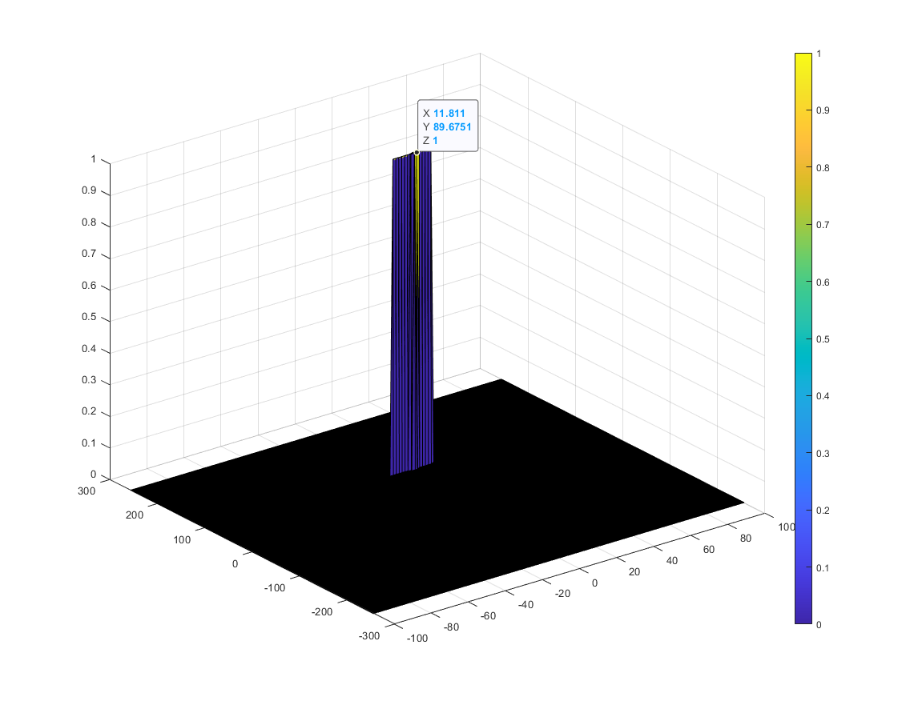

# Radar Target Generation and Detection

## Introduction

This project simulates a moving target radar detection. The target moves with a constant velocity model and within the range of the Radar specifications (Max range and velocity). The complete simulation and detection process/pipeline is implemented in  the `radar_target_generation_and_detection.m` Matlab file.The `Section and layout` documents  the project's components and how they relate to the code sections.

## Section and layout

* Configuration of the FMCW waveform based on the system requirements. (`FMCW Waveform Generation` code section)
* Defining the range and velocity of target and simulate its displacement. (` User Defined Range and Velocity of target` code section)
* Transmit and receive signal to determine the beat signal. (`Signal generation and Moving Target simulation` section)

* Perform Range FFT on the received signal to determine the Range (`RANGE MEASUREMENT` and `RANGE DOPPLER RESPONSE` code sections)

* Towards the end, a CFAR processing on the output of 2nd FFT to display the target. (`CFAR implementation` code section)


## CFAR 2D

### Implementation steps

1- A context window of size `(2*(Tr+Gr)+1)^2` is slid over the FFT2D output (Range/Doppler).
2- The resulted crop is then stored in `TGCrop.`. The guard cells and cut cell represented by  `GCrop` are substructed from the slid window to keep only the Training cells in `util.` The noise level is extracted as an average of converted values from logarithmic to linear using db2pow  on the `util`/Training cells transformed back to logarithmic using pow2db.
3- The offset is added to the noise level to determine the threshold
4- If the CUT level > threshold  value 1 is assigned to the output, else equate it to 0.


The initialization `output = zeros(size(RDM));` of the CFAR output using the FFT2D output RDM shape takes care of the non-thresholded cell at the edges that receive 0 value.


```matlab

training_cells_nbr = (2*(Tr+Gr)+1)*(2*(Td+Gd)+1) - ((2*Gr+1)*(2*Gd+1));  % Get only the util cardinality (training cell)

output = zeros(size(RDM));

for i = Tr+Gr+1:Nr/2-(Tr+Gr)
    for j = Td+Gd+1:Nd-(Td+Gd)
        %Slide Window through the complete Range Doppler Map
        TGCrop = RDM(i-(Gr+Tr):i+Gr+Tr, j-(Gd+Td):j+Gd+Td); % T + G + cut a context crop
        GCrop = zeros(size(TGCrop));
        GCrop(Tr+1:Tr+2*Gr+1, Td+1:Td+2*Gd+1) = RDM(i-Gr:i+Gr,j-Gd:j+Gd); % G + cut crop

        util = TGCrop - GCrop; % Extracts util region (Training cells)
        % size(util(util > 0))(0) == training_cells_nbr % a sanity check of
        % training cells nbr

        % Sum converted the values from logarithmic to linear using db2pow.
        % Average the summed values for all of the training
        % cells used and convert it back to logarithmic using pow2db.
        noise_level =  pow2db(sum(db2pow(util(util > 0))) / training_cells_nbr);

        % Add the offset to it to determine the threshold
        % If the CUT level > threshold assign it a value of 1, else equate it to 0.
        output(i, j) = (RDM(i, j) > (noise_level + offset));
    end
end
```

### Selection of Training, Guard cells and offset

For the Training/Guard cells and offset parameters, they are chosen so that the guard cells avoid the signal to be included in the Training cells. The training cell context is reasonably large (but not too large) to include the surrounding noise level. The offset is calibrated accordingly. Two configurations were tried below:

1- First config (config 1)
```matlab
Tr = 20; % training cells (range)
Td = 20; % training cells (doppler)

%Select the number of Guard Cells in both dimensions around the Cell under
Gr = 4;  % number of Guard Cells (range)
Gd = 4;  % number of Guard Cells (doppler)
offset = 5 % offset the threshold by SNR value in dB
```

2- Second config (config 2) a smaller training region while skipping more `cut` neighborhood with a bit larger guard cells.

```matlab
Tr = 12; % training cells (range)
Td = 12; % training cells (doppler)

%Select the number of Guard Cells in both dimensions around the Cell under
Gr = 6;  % number of Guard Cells (range)
Gd = 6;  % number of Guard Cells (doppler)
offset = 5 % offset the threshold by SNR value in dB
```

### CFAR output example instance (config 1)

For a generated range of 90 and velocity of 10 m/s

```matlab
R_init = 90 % vehicle range
v=10 % vehicle velocity
```

We obtain the following output


### CFAR output example instance (config 2)

We can remark pretty stable output for a `reasonable` parameters' range/sub-space. See the config 2 output reported below


